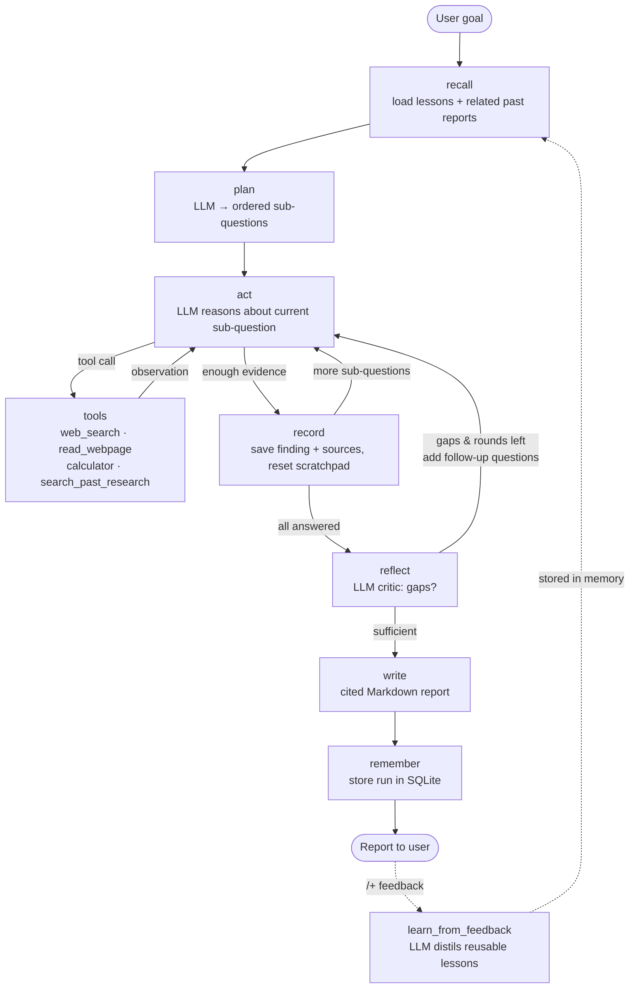

# Autonomous Research Agent

An LLM-powered **agentic research system** built for the *AI Agentic System Challenge* (Techvruk).
Give it a research goal. It **plans** sub-questions, **reasons and acts** with tools, **observes**
the results, **reflects** on gaps and researches more if needed, then **writes** a cited report.
It **gets better with use**: it remembers past research and turns your feedback into lessons
that shape future plans and reports.

> Plan → Act → Observe → Reflect → Respond. This is a multi-step workflow with state, tools,
> conditional branching and long-term memory, not a single prompt-response call.

---

## 1. Problem / task chosen

**Research Agent:** given a topic, search the web, read sources, do any needed calculations,
and compile a short, well-sourced report.

Why this task: research is open-ended, so the agent really has to *decide* what to do next
(which query to run, which page to open, when it has enough evidence, whether the overall
answer has gaps). That shows agentic behaviour better than a fixed pipeline.

### Research modes: one engine, four business tasks

The same agent workflow is specialised for the business-intelligence tasks listed in the
contest brief. A mode changes **what the planner covers, what evidence the executor hunts for,
what the critic checks, and the shape of the final report**. The graph itself doesn't change.

| Mode | Example goal | Report sections |
|---|---|---|
| **General Research** | *Compare LangGraph, CrewAI and AutoGen* | Key Findings · Details · Limitations |
| **Competitor Intelligence** | *Who are Zoho CRM's main competitors and how do they compare on pricing?* | Competitor Comparison table · Company Profiles · Strategic Signals (launches, funding, hiring) · Opportunities & Threats |
| **Market Research** | *Size and growth rate of the EV charging market in India* | Market Size & Growth table · TAM/SAM/SOM (with calculator-checked arithmetic) · Key Players · Drivers & Trends |
| **Lead Research** | *Engineering colleges in Bangalore with AI/ML programs* | Lead Table · Fit Scoring (High/Medium/Low) · Suggested Outreach Angle |

Modes are plain data in [`agent/modes.py`](agent/modes.py), so adding a new one (e.g. a hiring
tracker) takes one entry, not new code. Lead Research only collects public,
organisation-level contact routes and never guesses personal emails or phone numbers.

## 2. Features

| Agentic principle | How it's implemented |
|---|---|
| **Task input** | Text goal plus a research mode, via Web UI (Streamlit), CLI, or REST API (FastAPI) |
| **Planning** | `plan` node: LLM breaks the goal into ≤3 ordered sub-questions (structured output) |
| **Reasoning + tool use (ReAct)** | `act` ⇄ `tools` loop per sub-question: the LLM chooses a tool, sees the result, decides again |
| **Tools** | `web_search` (DuckDuckGo), `read_webpage` (HTML → text), `calculator` (safe AST eval), `search_past_research` (memory) |
| **State / context** | One typed `ResearchState` flows through every node: plan, step index, scratchpad, findings, critique, trace |
| **Conditional workflow** | Routers decide: call tool vs answer, next sub-question vs reflect, research more vs write |
| **Self-reflection** | `reflect` node critiques the findings and adds follow-up questions if there are gaps |
| **Final output** | Markdown report with TL;DR, key findings, limitations, numbered sources; saved to `reports/` |
| **Gets better with use** | SQLite memory stores past runs and **lessons distilled from user feedback**; they are injected into planning, tool use and writing on future runs |
| **Safety bounds** | Tool budget per step, max reflection rounds, recursion limit, retries on rate limits / malformed tool calls, automatic fallback model |
| **Trustworthy citations** | Only URLs that a tool actually returned can be cited; the Sources list is built in code, not by the LLM |

## 3. Architecture & workflow



**Components**

```
research-agent/
├── agent/
│   ├── state.py     # ResearchState: the shared context carried across all steps
│   ├── graph.py     # LangGraph wiring: nodes + conditional edges, streaming runner
│   ├── nodes.py     # recall, plan, act, tools, record, reflect, write, remember + routers
│   ├── tools.py     # web_search, read_webpage, calculator, search_past_research
│   ├── memory.py    # SQLite long-term memory: runs, ratings, lessons
│   ├── modes.py     # research modes: general / competitor / market / leads
│   ├── prompts.py   # all prompt templates (planner, executor, critic, writer, lesson extractor)
│   ├── llm.py       # LLM factory (Groq), easy to swap provider
│   └── config.py    # env config + safety limits
├── app.py           # Streamlit UI with live step-by-step trace
├── cli.py           # terminal interface
├── api.py           # FastAPI: POST /research, POST /feedback, GET /memory
├── tests/           # offline tests (fake LLM drives the full graph)
└── reports/         # generated reports
```

**Design decisions**

- **Plan-and-Execute + ReAct hybrid.** A global plan keeps the research structured, and a
  ReAct loop inside each step lets the agent adapt to what it finds.
- **Fresh scratchpad per sub-question.** Only a compact summary of earlier findings is carried
  forward. That keeps prompts small (free-tier token limits) while still keeping context.
- **Critic loop.** A separate reflection step catches gaps a single pass would miss. It is
  bounded by `MAX_REFLECTION_ROUNDS` so it always terminates.
- **Learning from feedback without fine-tuning.** Feedback is turned into general, reusable
  lessons (e.g. *"Include a comparison table when comparing tools"*). Poorly rated reports are
  excluded from reuse.

## 4. Setup & run

Requirements: Python 3.10+, a **free** Groq API key from https://console.groq.com/keys

```bash
git clone <this-repo-url>
cd research-agent
python -m venv .venv
# Windows: .venv\Scripts\activate    macOS/Linux: source .venv/bin/activate
pip install -r requirements.txt
cp .env.example .env        # then put your GROQ_API_KEY in .env
```

Run it any of three ways:

```bash
streamlit run app.py                                   # Web UI (recommended)
python cli.py "Compare LangGraph, CrewAI and AutoGen"  # terminal
python cli.py --mode market "EV charging market in India"
uvicorn api:app --reload                               # REST API → http://127.0.0.1:8000/docs
```

Run the offline tests (no key or internet needed):

```bash
python -m pytest -q
```

## 5. Sample input / output

**Input:**

```
How big is the global AI agents market in 2025 and what growth rate (CAGR) is forecast to 2030?
```

**Agent trace (abridged, from a real run):**

```
RECALL:  0 lesson(s), 1 related past report(s)
PLAN:
 - What is the estimated size of the global AI agents market in 2025?
 - What CAGR is forecast for the global AI agents market from 2025 to 2030?
 - How do different research firms compare in their 2025 estimates and CAGR forecasts?
ACT [Q1]:  web_search('global AI agents market size 2025 report')
OBSERVE:   web_search returned 4066 chars
ACT [Q1]:  read_webpage('https://www.marketsandmarkets.com/Market-Reports/ai-agents-market-...')
ACT [Q1]:  has enough evidence -> answering
ACT [Q2]:  web_search(...) -> search failed x3 (rate limit)  -> answers "no data found"
ACT [Q3]:  web_search('Gartner AI agents market size 2025') ...
REFLECT: gaps found - "findings lack a clear, sourced CAGR for 2025-2030; Q2 admits no data"
  Adding:
   - What is the specific CAGR forecast ... according to MarketsandMarkets (or other primary sources)?
   - Can you provide a reliable source that states the projected 2030 market size?
ACT [Q4]:  web_search('MarketsandMarkets AI agents market 2025 2030 CAGR 46.3') ...
ACT [Q5]:  ...
REFLECT: findings sufficient
WRITE:   report saved to reports/...-how-big-is-the-global-ai-agents-market-....md
REMEMBER: stored as run #3
```

The critic noticed that Q2 had failed (search was rate-limited) and **sent the agent back
to close that gap**. That self-correction is the difference between an agent and a
one-shot prompt.

**Output (excerpt):**

> # Global AI-Agents Market Outlook (2025 – 2030)
> **TL;DR** – Recent market-research reports converge on a 2025 market size of roughly
> **US $7-8 billion** for AI agents. MarketsandMarkets projects **US $52.6 billion by
> 2030**, a **CAGR of ≈ 46 %**.
>
> | Source | 2025 Estimate (USD) |
> |---|---|
> | MarketsandMarkets | $7.84 bn |
> | Grand View Research | $7.6 bn |
> | Fortune Business Insights | $8.03 bn |
>
> *…Limitations… Sources: 9 verified URLs*

Full reports from real runs are in [`reports/`](reports/).

**Feedback → learning:**

```
User (): "Good tables. Next time always verify growth rates with the calculator tool
           and show the formula used."
Learned:   - Verify growth rates using the calculator tool before reporting them.
           - Include the formulas used for any calculations in the report.
```

These lessons are stored in SQLite and injected into the planner, executor and writer prompts
on every later run.

## 6. LLM & API disclosure

- **LLM:** `openai/gpt-oss-120b` via **Groq free tier** (open-weights model, Apache 2.0), with
  automatic fallback to `openai/gpt-oss-20b` when the free daily token quota runs out.
  No paid APIs are used.
- **Search:** DuckDuckGo via the `ddgs` package (free, no key).
- **AI assistance:** an AI coding assistant was used for coding help, as the
  contest rules allow. The task choice, workflow design (plan / ReAct / reflect / memory-from-feedback),
  and tool set were my decisions. See `AI_USAGE.md`.

## 7. Limitations & future work

- Research quality depends on the free model and free search. The agent flags conflicting
  figures in *Limitations*, but numbers should still be spot-checked.
- Free-tier quota is ~200k tokens/day per model (≈ 4 runs); the fallback model roughly doubles that.
- Keyword-overlap memory retrieval; embeddings (e.g. a vector store) would recall better.
- DuckDuckGo can rate-limit heavy use; Tavily/SerpAPI could be plugged into `tools.py`.
- Scheduled recurring research (e.g. a weekly competitor report) could be added with a cron trigger.
